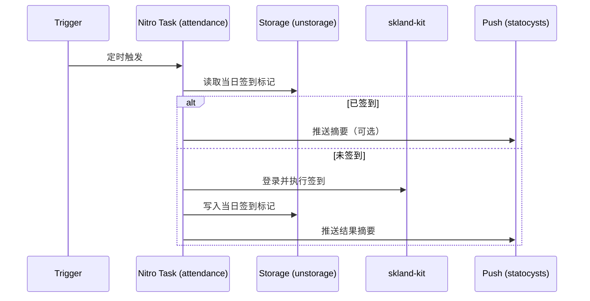

# 架构设计

## 总体架构

```mermaid
flowchart TD
    A[触发器\n(GitHub Actions / Workers Cron / Nitro scheduledTasks)] --> B[任务: attendance]
    B --> C[skland-kit\n登录与签到 API]
    B --> D[持久化存储\nunstorage]
    B --> E[通知推送\nstatocysts]
```

## 技术栈
- **语言:** TypeScript
- **运行框架:** Nitro（实验性 tasks + scheduledTasks）
- **部署形态:** GitHub Actions / Docker / Cloudflare Workers（Wrangler）
- **存储:** unstorage（本地文件 / Redis / Upstash / Cloudflare KV / S3 等）
- **通知:** statocysts（多渠道通知聚合）

## 核心流程



## 重大架构决策

完整的 ADR 存储在各变更的 how.md 中，本章节提供索引。

| adr_id | title | date | status | affected_modules | details |
|--------|-------|------|--------|------------------|---------|
| ADR-001 | Upstream 同步与保活分支策略 | 2026-02-10 | ✅已采纳 | ci | [details](../history/2026-02/202602101830_sync-upstream/how.md#adr-001-upstream-同步与保活分支策略) |
